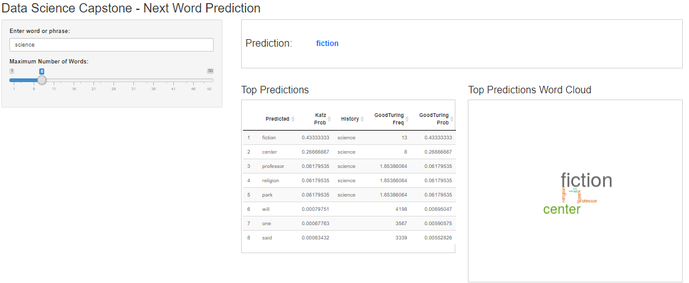

## Introduction

Predicting the next word a user will type is a known data science problem that relies on fundamental NLP principles. These are useful in a
number of different applications.

The application that was created for this project uses N-gram modeling implemented using the Katz back-off method and Good Turing smoothing.

In addition to predicting the next word, the application provides insights into how it works. It provides the following:

  1. Table of top predictions based on user inputs which displays the following:
            Katz Probability, History, Good Turing Frequency, and Good Turing Probability

  2. Word Cloud that allows users to visually see what are the most likely workds as the predictions are weighted by the
            Good Turing Probability

--- .class #id 

## Model Description

The model driving predictions in this project leverages one-grams, two-grams, tri-grams, and four-grams. The N-gram model was implemented
by generating condinional probabilities using the history (previous words) and their corresponding frequencies. 

Good-Turing (k<=5) smoothing was used to allot small probabilities to n-grams that were not seen in the training set. 

In the user interface, when a user inputs a word, the app will clean the input, and predict the next word using the Katz back-off 
method; the top prediction will be the match with the highest possible n-gram. To do this, katz probabilities are calcualted for each
possible prediction by multiplying the Good-Turing probabilitues times Katz Alpha (a function of the frequencies and Good turing probabilities of the words predicted or not predicted by the corresponding n-gram).

Due to hardware constraints, english stop words were removed from the training set. 

--- .class #id 

## App Inputs and Outputs

A very intiutive lay out and design was given to the User Interface to provide a robust user experience. The user can intuitively see
where to input his word and where the outputs are rendered.

* Input: Word or phrase that will be used to predict the next word; A slider to denote the number of predictions that the user wants to see

* Output: Top prediction; Dataframe displaying the different attributes of the words predicted; A word cloud visually displaying the 
            top words predicted, weigthed by the Good Turing probabilities

The dashboard provides an clear insight into the predictive modeling engine that can be digestable not only by data scientists, but also by functional stakeholders.

--- .class #id 

## Using The App - Intuitive UI

--- .class #id 

## Conslusion and Shiny App Link

The existing infrastructure and predictive power of this application can be build upon and enhanced to takcle more intricate NLP problems. 
Additionally, machines with superior hardware can leverage this existing framework to expand on the predicitive capabilities of the model.

Go to the app [here](https://jaimeoh123.shinyapps.io/DataScienceCapstone-PredictNextWord/)

